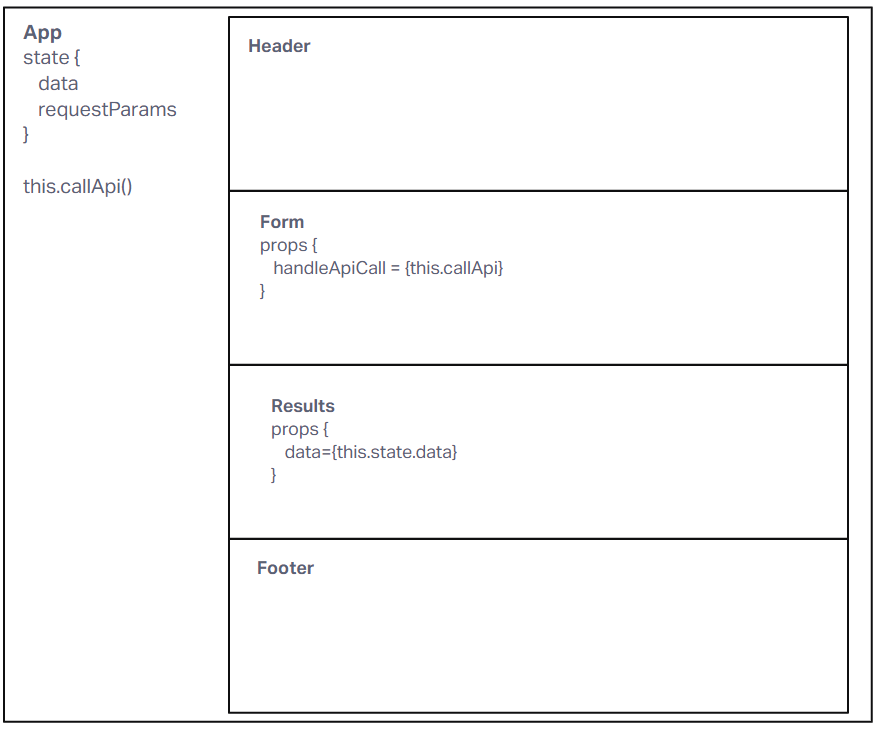

# LAB - Class 26

## Project: Resty

### Author: Brandon Perard

### Problem Domain  

This application will be an API testing tool that can be run in any browser, allowing a user to easily interact with APIs in a familiar interface.

### Links and Resources

- [GitHub Actions ci/cd](https://github.com/bperard/resty/actions)
<!-- - [back-end server url](http://xyz.com) (when applicable) -->
- [base branch deploy](https://codesandbox.io/p/github/bperard/resty/draft/smoosh-sun?file=%2FREADME.md&workspace=%257B%2522activeFileId%2522%253A%2522clfiov0il0008g1i055pc21zg%2522%252C%2522openFiles%2522%253A%255B%2522%252FREADME.md%2522%255D%252C%2522sidebarPanel%2522%253A%2522EXPLORER%2522%252C%2522gitSidebarPanel%2522%253A%2522COMMIT%2522%252C%2522spaces%2522%253A%257B%2522clfiov1mc000x356ix1x3fkzp%2522%253A%257B%2522key%2522%253A%2522clfiov1mc000x356ix1x3fkzp%2522%252C%2522name%2522%253A%2522Default%2522%252C%2522devtools%2522%253A%255B%257B%2522key%2522%253A%2522clfipjxls00gy356iovgsfzqw%2522%252C%2522type%2522%253A%2522PROJECT_SETUP%2522%252C%2522isMinimized%2522%253Afalse%257D%252C%257B%2522type%2522%253A%2522PREVIEW%2522%252C%2522taskId%2522%253A%2522start%2522%252C%2522port%2522%253A3000%252C%2522key%2522%253A%2522clfiovt1e009k356ie06ihzvd%2522%252C%2522isMinimized%2522%253Afalse%257D%252C%257B%2522type%2522%253A%2522TASK_LOG%2522%252C%2522taskId%2522%253A%2522start%2522%252C%2522key%2522%253A%2522clfiovq1l006c356idje6urw2%2522%252C%2522isMinimized%2522%253Afalse%257D%255D%257D%257D%252C%2522currentSpace%2522%253A%2522clfiov1mc000x356ix1x3fkzp%2522%252C%2522spacesOrder%2522%253A%255B%2522clfiov1mc000x356ix1x3fkzp%2522%255D%252C%2522hideCodeEditor%2522%253Afalse%257D)

### Setup

#### `.env` requirements (where applicable)

none for now

#### How to initialize/run your application (where applicable)

`npm start`

#### How to use your library (where applicable)

#### Features / Routes

- Features are mocked for now

#### Tests

- Each component will have react testing for rendered elements

#### UML

